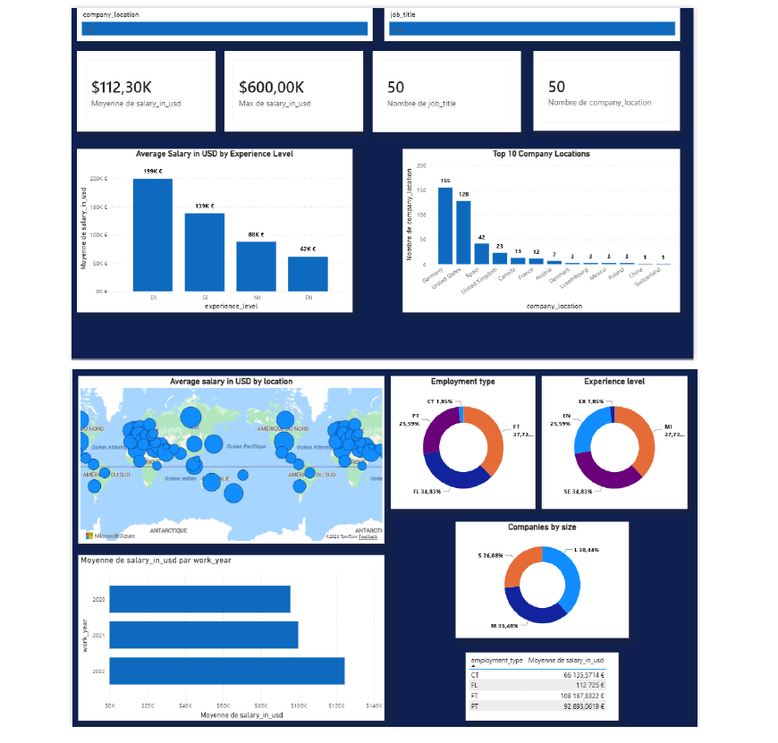

# 📊 IT Job Market Analysis using Python & Power BI

## Project Overview

This project analyzes the IT job market using a dataset of Data Science and AI job salaries. The objective is to explore salary trends, job distributions, company characteristics, and geographical insights using Python for data analysis and Power BI for interactive visualization.

---

## 📊 Dashboard Preview



---

## 🎯 Objectives

- Explore and clean the dataset.
- Analyze salary distributions.
- Identify the most common job titles.
- Compare salaries by experience level.
- Analyze salaries based on company size.
- Study job distribution across countries.
- Build an interactive Power BI dashboard.

---

## 📂 Dataset

**Dataset:** Data Science Job Salaries

The dataset contains information about:

- Work Year
- Experience Level
- Employment Type
- Job Title
- Salary
- Salary Currency
- Salary in USD
- Employee Residence
- Remote Ratio
- Company Location
- Company Size

---

## 🛠 Technologies Used

- Python
- Pandas
- Matplotlib
- Power BI
- GitHub

---

## 📁 Project Structure

```text
IT_Job_Market_Analysis
│
├── ds_salaries.csv
├── exploration.py
├── analysis.py
├── visualization.py
├── company_size_analysis.py
├── country_analysis.py
├── IT_Job_Market.pbix
├── IT_Job_Market_Report.pdf
├── dashboard.png
└── README.md
```

---

## 📈 Python Analysis

The analysis includes:

- Data exploration
- Data cleaning
- Duplicate removal
- Salary statistics
- Job title analysis
- Company size analysis
- Country analysis
- Data visualization

---

## 📊 Power BI Dashboard

### KPI Cards

- Average Salary
- Maximum Salary
- Total Job Titles
- Total Countries

### Visualizations

- Average Salary by Experience Level
- Average Salary by Company Size
- Top Job Titles
- Jobs by Country
- Remote Work Distribution

### Filters

- Work Year
- Experience Level
- Employment Type
- Company Size

---

## 🔍 Key Insights

- Senior and Executive positions receive the highest salaries.
- Large companies generally offer higher salaries than small companies.
- The United States has the highest number of Data Science job opportunities in the dataset.
- Data Scientist and Data Engineer are among the most common job titles.
- Remote work has become increasingly common across the industry.

---

## 🚀 How to Run

### Python

```bash
python exploration.py
python analysis.py
python visualization.py
python company_size_analysis.py
python country_analysis.py
```

### Power BI

Open the `IT_Job_Market.pbix` file using Microsoft Power BI Desktop.

---

## 📄 Report

The repository also includes a PDF report presenting:

- Data exploration
- Analysis results
- Dashboard screenshots
- Business insights

---

## 👩‍💻 Author

**Yousra Erraki**

Computer Engineering Student

Specialization: Data Science & Artificial Intelligence

EMSI – Morocco

GitHub: https://github.com/yousraerraki

---

## ⭐ Skills Demonstrated

- Data Cleaning
- Exploratory Data Analysis (EDA)
- Business Intelligence
- Data Visualization
- Power BI Dashboard Design
- Python Programming
- Data Analysis with Pandas
- Reporting and Data Storytelling

---

## 📜 License

This project was developed for educational and portfolio purposes.
